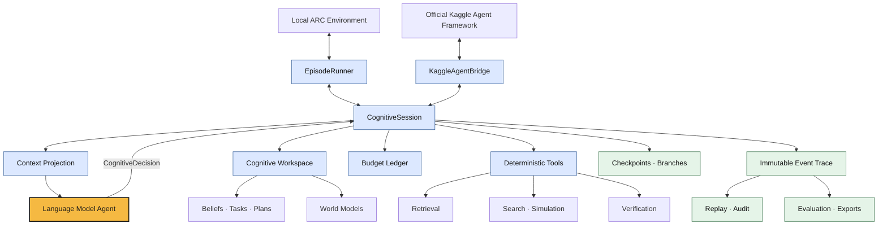

# ARC-Exocortex (AREx)

An offline-first cognitive harness for language-model agents in ARC-AGI-3.

> **The language model is the agent. The harness is its cognitive substrate.**

AREx gives an LM persistent memory, deterministic tools, guarded execution, and
research-grade traces without moving semantic or strategic decisions into the
infrastructure.

## Approach

The model owns interpretation, hypotheses, relevance, goals, planning intent,
exploration, recovery diagnosis, and action selection.

The harness provides the deterministic machinery around that cognition. It can
store and retrieve evidence, calculate, search, simulate, verify, enforce budgets,
execute authorized actions, checkpoint, replay, branch, log, and evaluate. These
operations return evidence to the model; they do not silently decide what the
evidence means or what the agent should do next.

This boundary makes the system useful for experiments comparing stronger models
with thinner harnesses against weaker models with more external cognitive
support—while keeping agency attributable to the LM.

## System



The runtime never invents a fallback action or replacement strategy. Every
environment action must be an exact authorization from a persisted model
decision. Deterministic verification may stop invalid execution, but the model
decides how to interpret the failure and what to try next.

## Harness capabilities

- **Typed cognitive interface:** strict, versioned contracts for observations,
  decisions, actions, hypotheses, tasks, tools, predictions, and recovery.
- **Persistent workspace:** versioned beliefs, task DAGs, plans, declarative world
  models, exact evidence retrieval, and checkpointed cognitive state.
- **Deterministic computation:** state deltas, belief arithmetic, bounded BFS/A*,
  simulation, exploration accounting, and prediction verification.
- **Guarded execution:** typed budgets, action authorization, bounded action
  chunks, per-step verification, soft interrupts, and objective hard stops.
- **Recovery and replay:** first-divergence evidence, immutable failed branches,
  checkpoint forks, recorded model/environment adapters, and causal agency audits.
- **Research trace:** hash-chained JSONL events, normalized run manifests,
  checksummed checkpoints, deterministic metrics, typed ablations, and rebuildable
  SQLite/FTS5 and tabular exports.
- **Replaceable adapters:** deterministic fakes, local ARC and Kaggle callback
  boundaries, structured model output, offline Transformers, and optional Ollama.

Raw events and the run manifest are authoritative. Indexes, summaries, and
analysis tables are derived artifacts that can be rebuilt from the trace.

## Current system

The current implementation is a synchronous Python 3.12 runtime with Pydantic
contracts and replaceable model/environment protocols. It includes:

- the complete observation → decision → action → verification loop;
- one callback-driven cognitive session shared by local and Kaggle outer loops;
- deterministic fake adapters for golden replay and regression testing;
- official offline ARC environment execution;
- attached-weight Qwen inference through a lazy, offline Transformers backend;
- optional local Ollama experiments;
- cognitive workspace, search, simulation, recovery, branching, and replay;
- CLI workflows for runs, trace verification, indexing, and export; and
- one set of named runtime profiles shared by local, Colab, and Kaggle runs.

The maintained Colab path uses Transformers with local model weights. A smoke
generation checks the loaded model before the episode; it is not a benchmark
result. The Kaggle submission remains an independent offline profile.

## Run locally

Install the core environment:

```bash
uv sync
```

Run the deterministic end-to-end fixture:

```bash
uv run arc-agi-3 fake-run --output runs --run-id smoke
uv run arc-agi-3 verify-trace runs/smoke/events.jsonl
```

For official local ARC environments:

```bash
uv sync --extra arc
```

The older Ollama notebook remains available for local experiments:
[`notebooks/arc_agi_3_local_qwen_kaggle_parity.ipynb`](notebooks/arc_agi_3_local_qwen_kaggle_parity.ipynb).
The maintained local Transformers path is
[`notebooks/arc_agi_3_local_transformers.ipynb`](notebooks/arc_agi_3_local_transformers.ipynb).

## Runtime profiles

[`configs/runtime.toml`](configs/runtime.toml) defines `colab_transformers`,
`kaggle_submission`, and `local_smoke`. Resolve one profile with
`arc_agi_3.settings.resolve_runtime(profile, overrides=...)`. Values apply in
this order: typed defaults, named profile, `AREX_` environment variables, then
explicit overrides. The resolved object composes the Transformers backend,
budgets, run configuration, structured adapter, and runner. For example:

```python
from arc_agi_3.settings import resolve_runtime

settings = resolve_runtime(
    "colab_transformers",
    overrides={
        "model_path": "/content/drive/MyDrive/AREx/models/YOUR_MODEL_DIRECTORY",
        "model_name": "YOUR_MODEL_ID",
    },
)
print(settings.model_dump(mode="json"))
```

The Colab profile requires an explicit `model_path` or `AREX_MODEL_PATH`; the
repository does not infer an ID from the Drive directory. Its initial limits
include eight turns and model calls, 40 actions, 32,768 input tokens per prompt,
and one repair. A warning appears when model calls are fewer than turns. Kaggle
selects `kaggle_submission` through `KaggleSettings` and keeps its own limits;
`kaggle/config.json` supplies kernel and attached-source metadata.

## Colab Transformers workflow

Open [`notebooks/arc_agi_3_colab_transformers.ipynb`](notebooks/arc_agi_3_colab_transformers.ipynb).
It mounts Drive, prepares Python 3.12 with `uv`, and invokes the repository's
`arc_agi_3.research.colab_entry` command. Replace only the notebook's
`OVERRIDES` values for `model_path` and `model_name`, then run its cells. The
model is loaded once, used for a smoke generation, and reused for the episode.
Run artifacts, checkpoints, and logs go to `/content/drive/MyDrive/AREx` by
default, with a unique run ID.

With `model_staging="copy_if_space"`, weights are copied from Drive to local
Colab storage after a free-space check. Drive remains the persistent source;
the local cache is ephemeral. Set `model_staging="none"` to load directly from
Drive, or override `model_cache_dir` to choose a cache path. The Transformers
backend enforces `max_input_tokens` without dropping required prompt content
and passes `generation_timeout_seconds` to generation.

## Budgets, context, and live trace

A **model call** is one high-level decision request. A structured-output repair
may make another backend generation within that same call; with
`max_repairs=1`, one call can contain two generations. Token and model-time
usage includes every completed generation, including attempts that fail
validation. Invalid decisions still fail strict schema checks and enter the
explicit repair path. Exhausted budgets finish normally with a resource-specific
reason: `model_call_budget_exhausted`, `action_budget_exhausted`,
`input_token_budget_exhausted`, `output_token_budget_exhausted`, or
`wall_time_budget_exhausted`.

The current observation keeps its complete frame. Model-facing recent events
are bounded and compacted to avoid repeating historical frames and decision
payloads; recovery evidence is compacted too. `events.jsonl` keeps the exact
canonical events for replay. `recent_event_limit` and `compact_context` control
the projection.

`live_trace_mode` supports `silent`, `readable`, and `json`. Readable mode shows
public decisions, actions, usage, budgets, and outcomes; JSON mode streams full
canonical events. Configured logs persist the displayed stream. Normal traces
store failed-output hashes and validation errors, not raw model output. Set
`persist_invalid_model_output=true` only for debugging to include a bounded
512-character preview in run artifacts. No private chain-of-thought is shown.

## Validation

Run `uv run pytest`, `uv run ruff check .`, `uv run ruff format --check .`,
and `uv run mypy` for repository checks. Unit tests use fake backends and do not
download weights or require a GPU.

Competition datasets, model assets, run artifacts, builds, and internal research
or planning documents are intentionally excluded from version control.
