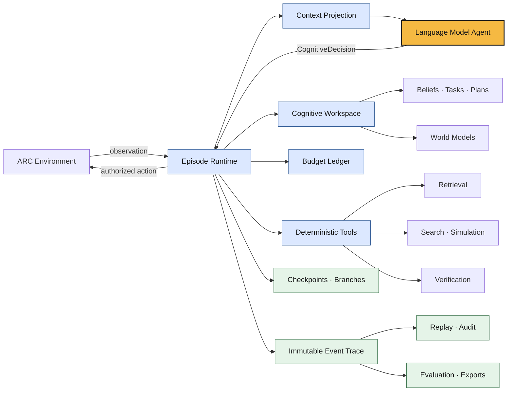

# ARC-Exocortex (AREx)

An offline-first cognitive harness for language-model agents in ARC-AGI-3.

> **The language model is the agent. The harness is its cognitive substrate.**

AREx gives an LM persistent memory, deterministic tools, guarded execution, and
research-grade traces without moving semantic or strategic decisions into the
infrastructure.

## Approach

The model owns interpretation, hypotheses, relevance, goals, planning intent,
exploration, recovery diagnosis, and action selection.

The harness provides the deterministic machinery around that cognition. It can
store and retrieve evidence, calculate, search, simulate, verify, enforce budgets,
execute authorized actions, checkpoint, replay, branch, log, and evaluate. These
operations return evidence to the model; they do not silently decide what the
evidence means or what the agent should do next.

This boundary makes the system useful for experiments comparing stronger models
with thinner harnesses against weaker models with more external cognitive
support—while keeping agency attributable to the LM.

## System



The runtime never invents a fallback action or replacement strategy. Every
environment action must be an exact authorization from a persisted model
decision. Deterministic verification may stop invalid execution, but the model
decides how to interpret the failure and what to try next.

## Harness capabilities

- **Typed cognitive interface:** strict, versioned contracts for observations,
  decisions, actions, hypotheses, tasks, tools, predictions, and recovery.
- **Persistent workspace:** versioned beliefs, task DAGs, plans, declarative world
  models, exact evidence retrieval, and checkpointed cognitive state.
- **Deterministic computation:** state deltas, belief arithmetic, bounded BFS/A*,
  simulation, exploration accounting, and prediction verification.
- **Guarded execution:** typed budgets, action authorization, bounded action
  chunks, per-step verification, soft interrupts, and objective hard stops.
- **Recovery and replay:** first-divergence evidence, immutable failed branches,
  checkpoint forks, recorded model/environment adapters, and causal agency audits.
- **Research trace:** hash-chained JSONL events, normalized run manifests,
  checksummed checkpoints, deterministic metrics, typed ablations, and rebuildable
  SQLite/FTS5 and tabular exports.
- **Replaceable adapters:** deterministic fakes, the official local ARC adapter,
  structured model output, and a local Ollama backend.

Raw events and the run manifest are authoritative. Indexes, summaries, and
analysis tables are derived artifacts that can be rebuilt from the trace.

## Current system

The current implementation is a synchronous Python 3.12 runtime with Pydantic
contracts and replaceable model/environment protocols. It includes:

- the complete observation → decision → action → verification loop;
- deterministic fake adapters for golden replay and regression testing;
- official offline ARC environment execution;
- local schema-constrained Qwen inference through Ollama;
- cognitive workspace, search, simulation, recovery, branching, and replay;
- CLI workflows for runs, trace verification, indexing, and export; and
- a centralized-config notebook that imitates the Kaggle entrypoint.

The local Qwen/`ls20` run was a one-turn integration smoke, not a solved-game or
benchmark claim. Ollama is a development backend; the Kaggle submission still
needs an attached-weight inference adapter behind the same model interface.

## Run locally

Install the core environment:

```bash
uv sync
```

Run the deterministic end-to-end fixture:

```bash
uv run arc-agi-3 fake-run --output runs --run-id smoke
uv run arc-agi-3 verify-trace runs/smoke/events.jsonl
```

For official local ARC environments:

```bash
uv sync --extra arc
```

For the local Qwen workflow, start Ollama and open
[`notebooks/arc_agi_3_local_qwen_kaggle_parity.ipynb`](notebooks/arc_agi_3_local_qwen_kaggle_parity.ipynb):

```bash
ollama pull qwen3.5:9b
ollama serve
```

The notebook centralizes paths, game, seeds, budgets, model settings, context
size, repair count, and turn limit. It loads the bundled environment in offline
mode, runs the harness, verifies the trace and agency boundary, and produces
derived research artifacts.

## Validation

- 57 passing tests with 89.54% measured coverage
- Strict mypy, Ruff linting, and formatting
- Source, wheel, and offline `pip --no-index` installation smokes
- Deterministic golden trace replay
- Official offline `ls20` plus local `qwen3.5:9b` integration smoke
- Complete notebook execution with zero agency-boundary violations

Competition datasets, model assets, run artifacts, builds, and internal research
or planning documents are intentionally excluded from version control.
